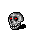
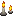
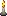

##  This is a story inside the castle. 

 This is a [Godot](https://godotengine.org/) project making for fun and learning, done in free time after the main courses at the university.

-----------------------------------------------------------------------------------------
###  Links for the ressources game : 

#### 1) <ins> **Packs in [itch.io](https://itch.io/)** </ins>:
- [Rogue Fantasy "Catacombs"](https://itch.io/queue/c/2326617/pixel-pack?game_id=603480).
- [Hero and Opponents Animation](https://itch.io/queue/c/2326617/pixel-pack?game_id=377218).
- [Sword Skeleton Pixel Art Character](https://itch.io/queue/c/2326617/pixel-pack?game_id=567091).
- [Animated pixel art skeleton](https://itch.io/queue/c/2326617/pixel-pack?game_id=914648).
- [Wizard pack](https://luizmelo.itch.io/wizard-pack)

#### 2) <ins> **Packs in [opengameart.com](https://opengameart.org/)** </ins>:
- [Dungeon Crawl](https://opengameart.org/content/dungeon-crawl-32x32-tiles).
- [Evil Dungeon](https://opengameart.org/content/evil-dungeon-asset-pack).
- [Castle Tiles](https://opengameart.org/content/castle-tiles-for-rpgs).
- [Within the abandoned castle](https://opengameart.org/content/within-the-abandoned-castle).

#### 3) <ins> **Fonts in [dafont.com](https://www.dafont.com/bitmap.php)** </ins>:
- [Alagard](https://www.dafont.com/alagard.font).
- [Perfect Dos VGA 437](https://www.dafont.com/perfect-dos-vga-437.font).

